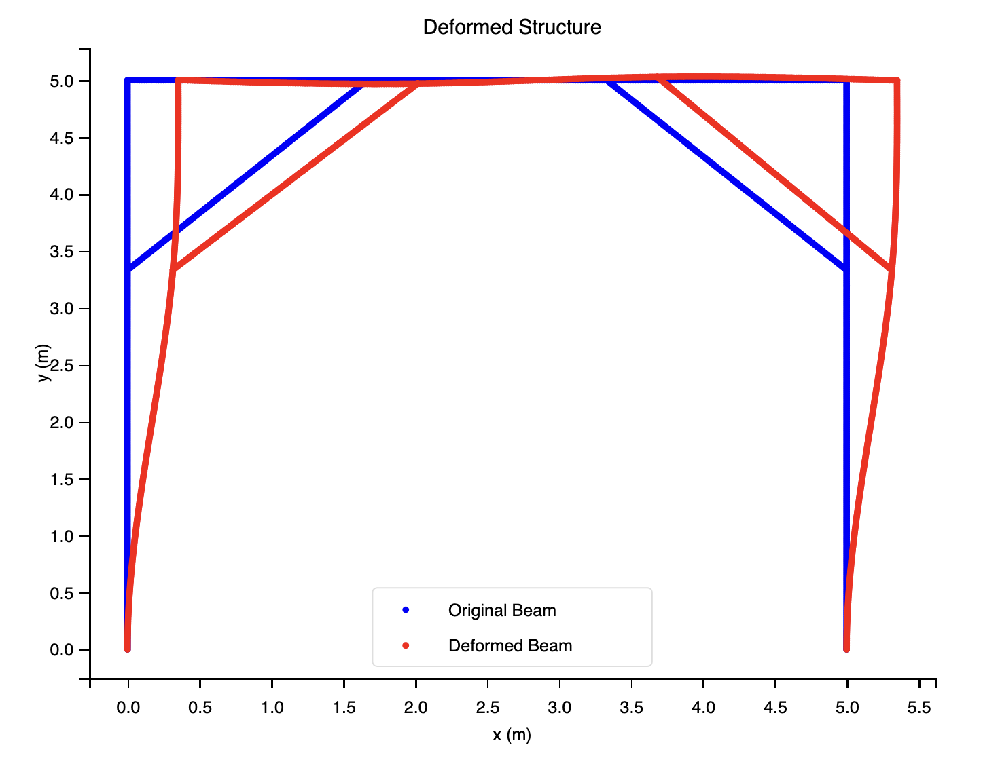

# Beam Analysis Project

## Overview

This project aims to analyze the behavior of a cantilever beam using the Finite Element Method (FEM). The project
includes both static and dynamic analyses, and generates visualizations of the beam's behavior under various loading
conditions.

## Getting Started

### Prerequisites

Make sure your environment have Python 3.6 or higher and install the required packages:

```sh
pip install -r requirements.txt
```

The required packages:

- numpy
- matplotlib
- scipy
- sympy

You can download the release from [HERE](https://github.com/HNU-WYH/Beam_Analysis/releases/).

## Usage(Example)

Below we have an example of a portal frame consisting of three crossbeams. The first beam is fixed at the left end and
the third beam is fixed at the right end. The second beam is connected to the first and third beams at the left and
right ends, respectively. A support beam is connected to the first and second beams and to one-third of the third and
second beams. All beams are connected in a hinged manner. A concentrated force of 10,000,000 N is applied at the right
end of the first beam. The beams are made of steel with the following properties: E = 210 GPa, A = 5383 mm^2, I = 36.92
mm^4, ρ = 42.3 kN/m^3. The length of each beam is 5 metres, with a discrete number of 60 elements per metre of beam. The
first beam was orientated vertically, the second beam horizontally and the third beam in the opposite vertical
direction. The static and dynamic response of the portal frame was analysed. The diagrams are given below:



```python
import math

from beam_analysis import *

# Initialize the basic parameters of the beam
length = 5.0
num_elements = 300
E = 210 * 10 ** 9
I = 36.92 * 10 ** (-6)
rho = 42.3
A = 5383 * 10 ** (-6)

# Initialize the beam, the beam will be divided into 2 or 3 parts so that the beam can be added the connection in the middle
beam_1_1 = Beam2D(2 * length / 3, E, A, rho, I, int(2 * num_elements / 3), angle=math.pi / 2)
beam_1_2 = Beam2D(length / 3, E, A, rho, I, int(num_elements / 3), angle=math.pi / 2)
beam_2_1 = Beam2D(length / 3, E, A, rho, I, int(num_elements / 3))
beam_2_2 = Beam2D(length / 3, E, A, rho, I, int(num_elements / 3))
beam_2_3 = Beam2D(length / 3, E, A, rho, I, int(num_elements / 3))
beam_3_1 = Beam2D(length / 3, E, A, rho, I, int(num_elements / 3), angle=-math.pi / 2)
beam_3_2 = Beam2D(2 * length / 3, E, A, rho, I, int(2 * num_elements / 3), angle=-math.pi / 2)
beam_support_1 = Beam2D(length / 3 * math.sqrt(2), E, A, rho, I, int(num_elements / 3 * math.sqrt(2)),
                        angle=math.pi / 4)
beam_support_2 = Beam2D(length / 3 * math.sqrt(2), E, A, rho, I, int(num_elements / 3 * math.sqrt(2)),
                        angle=-math.pi / 4)

# Initialize FEM Framework model
frame_work = FrameworkFEM()

# Add beams to the framework
frame_work.add_beam(beam_1_1)
frame_work.add_beam(beam_1_2)
frame_work.add_beam(beam_2_1)
frame_work.add_beam(beam_2_2)
frame_work.add_beam(beam_2_3)
frame_work.add_beam(beam_3_1)
frame_work.add_beam(beam_3_2)
frame_work.add_beam(beam_support_1)
frame_work.add_beam(beam_support_2)

# Add connections between beams
# Connect the beams that are divided for adding connections
frame_work.add_connection(beam_1_1, beam_1_2, (RIGHT_END, LEFT_END), ConnectionType.Fix)
frame_work.add_connection(beam_2_1, beam_2_2, (RIGHT_END, LEFT_END), ConnectionType.Fix)
frame_work.add_connection(beam_2_2, beam_2_3, (RIGHT_END, LEFT_END), ConnectionType.Fix)
frame_work.add_connection(beam_3_1, beam_3_2, (RIGHT_END, LEFT_END), ConnectionType.Fix)
# Connect the beams
frame_work.add_connection(beam_1_2, beam_2_1, (RIGHT_END, LEFT_END), ConnectionType.Hinge)
frame_work.add_connection(beam_2_3, beam_3_1, (RIGHT_END, LEFT_END), ConnectionType.Hinge)
frame_work.add_connection(beam_support_1, beam_1_2, (LEFT_END, LEFT_END), ConnectionType.Hinge)
frame_work.add_connection(beam_support_1, beam_2_1, (RIGHT_END, RIGHT_END), ConnectionType.Hinge)
frame_work.add_connection(beam_support_2, beam_3_1, (RIGHT_END, RIGHT_END), ConnectionType.Hinge)
frame_work.add_connection(beam_support_2, beam_2_3, (LEFT_END, LEFT_END), ConnectionType.Hinge)

# Add constraints
frame_work.add_constraint(beam_1_1, LEFT_END, 0, ConstraintType.DISPLACEMENT)
frame_work.add_constraint(beam_1_1, LEFT_END, 0, ConstraintType.AXIAL)
frame_work.add_constraint(beam_1_1, LEFT_END, 0, ConstraintType.ROTATION)
frame_work.add_constraint(beam_3_2, RIGHT_END, 0, ConstraintType.DISPLACEMENT)
frame_work.add_constraint(beam_3_2, RIGHT_END, 0, ConstraintType.AXIAL)
frame_work.add_constraint(beam_3_2, RIGHT_END, 0, ConstraintType.ROTATION)

# Add force 1000 kN at the right end of the first beam
frame_work.add_force(beam_1_2, (RIGHT_END, 1000000), LoadType.F)

# assemble the global matrices
frame_work.assemble_frame_matrices()

# Solve the static system
frame_work.solv()

# Solve the dynamic system
frame_work.solv(tau=0.1, num_steps=200, sol_type=SolvType.DYNAMIC)

# Visualize the solution
frame_work.visualize()
frame_work.visualize(sol_type=SolvType.DYNAMIC)
```