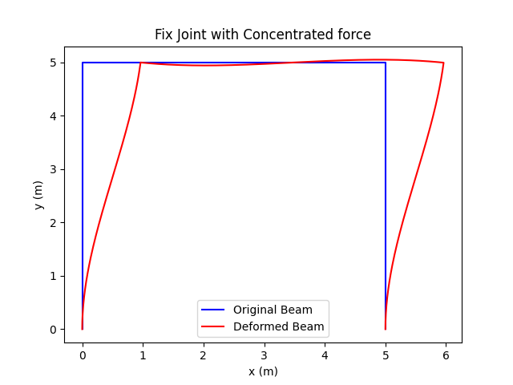

# Beam Analysis Project

## Overview

This project aims to analyze the behavior of a cantilever beam using the Finite Element Method (FEM). The project
includes both static and dynamic analyses, and generates visualizations of the beam's behavior under various loading
conditions.

## Getting Started

### Prerequisites

Make sure your environment have Python 3.6 or higher and install the required packages:

```sh
pip install -r requirements.txt
```

The required packages:

- numpy
- matplotlib
- scipy
- sympy
- pandas
- pyparsing
- fonttools

You can download the release from [HERE](https://github.com/HNU-WYH/Beam_Analysis/releases/).

## Usage(Example)

Here we provide an example of a portal frame consisting of three beams. The first beam is fixed at the left end, and the
third beam is fixed at the right end. The second beam is connected to the first and third beams at the left and right
ends, respectively. A concentrated force of 1,000,000 N is applied to the right end of the first beam. The beams are
made of steel with the following properties: E = 210 GPa, A = 5383 mm^2, I = 36.92 mm^4, and ρ = 42.3 kN/m^3. The length
of each beam is 5 m, and each beam is discretized into 100 elements. The first beam is oriented vertically, the second
beam is horizontal, and the third beam is oriented vertically in the opposite direction. The static and dynamic
responses of the portal frame are analyzed. The graph shown as below:



```python
import math

from config import LoadType, ConstraintType, SolvType, ConnectionType
from src.beam import Beam2D
from src.fem_frame import FrameworkFEM

# Initialize the basic parameters of the beam
length = 5.0
num_elements = 100
E = 210 * 10 ** 9
I = 36.92 * 10 ** (-6)
rho = 42.3
A = 5383 * 10 ** (-6)

# Initialize the beam
beam_1 = Beam2D(length, E, A, rho, I, num_elements, angle=math.pi / 2)
beam_2 = Beam2D(length, E, A, rho, I, num_elements)
beam_3 = Beam2D(length, E, A, rho, I, num_elements, angle=-math.pi / 2)

# Initialize FEM Framework model
frame_work = FrameworkFEM()

# Add beams to the framework
frame_work.add_beam(beam_1)
frame_work.add_beam(beam_2)
frame_work.add_beam(beam_3)

# Add connections between beams
frame_work.add_connection(beam_1, beam_2, (-1, 0), ConnectionType.Fix)
frame_work.add_connection(beam_2, beam_3, (-1, 0), ConnectionType.Fix)

# Add constraints
frame_work.add_constraint(beam_1, 0, 0, ConstraintType.DISPLACEMENT)
frame_work.add_constraint(beam_1, 0, 0, ConstraintType.AXIAL)
frame_work.add_constraint(beam_1, 0, 0, ConstraintType.ROTATION)
frame_work.add_constraint(beam_3, -1, 0, ConstraintType.DISPLACEMENT)
frame_work.add_constraint(beam_3, -1, 0, ConstraintType.AXIAL)
frame_work.add_constraint(beam_3, -1, 0, ConstraintType.ROTATION)

# Add forces
frame_work.add_force(beam_1, (-1, 1000000), LoadType.F)

# assemble the global matrices
frame_work.assemble_frame_matrices()

# Solve the static system
frame_work.solv()

# Solve the dynamic system
frame_work.solv(tau=0.1, num_steps=200, sol_type=SolvType.DYNAMIC)

# Visualize the solution
frame_work.visualize()
frame_work.visualize(sol_type=SolvType.DYNAMIC)
```